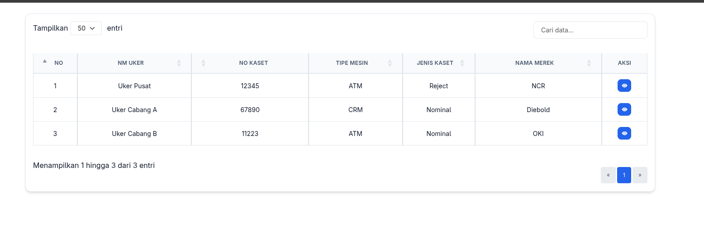

# @saulpaulus17/vue-datatables-flex

A high-performance, responsive DataTable component for Vue 3 and Nuxt 3/4.

[](https://www.npmjs.com/package/@saulpaulus17/vue-datatables-flex)
[](https://opensource.org/licenses/MIT)
[](https://vuejs.org/)
[](https://nuxt.com/)

---

## Features

- Optimized performance using DataTables
- Clean UI with Bootstrap 5 styling
- Fully responsive layout
- Nuxt 3 & 4 module support
- TypeScript support
- SSR-friendly rendering
- Indonesian locale ready

---

## 🚀 Installation

Install the package:

```bash
npm install @saulpaulus17/vue-datatables-flex
```

### Required Peer Dependencies

Ensure your project has the following essentials installed:

```bash
npm install vue bootstrap datatables.net-bs5
```

---

## 📦 Usage in Vue 3

### Global Registration

Recommended for large applications using the component across multiple pages.

```ts
// main.ts
import { createApp } from 'vue'
import { VueDatatablesFlex } from '@saulpaulus17/vue-datatables-flex'
import App from './App.vue'

// Import Required CSS
import 'bootstrap/dist/css/bootstrap.min.css'
import 'datatables.net-bs5/css/dataTables.bootstrap5.min.css'

const app = createApp(App)
app.use(VueDatatablesFlex)
app.mount('#app')
```

### Basic Usage

```vue
<template>
  <MainDataTable :data="userRows" :columns="userColumns" scroll-y="500px" @ready="onReady" />
</template>

<script setup lang="ts">
import { ref } from 'vue'
import type { Column } from '@saulpaulus17/vue-datatables-flex'

const userColumns: Column[] = [
  { data: 'id', title: 'ID' },
  { data: 'name', title: 'Full Name' },
  { data: 'email', title: 'Email Address' },
]

const userRows = ref([
  { id: 1, name: 'Ahmad', email: 'ahmad@example.com' },
  { id: 2, name: 'Budi', email: 'budi@example.com' },
])

const onReady = (dt: any) => console.log('Table instance:', dt)
</script>
```

---

## 🟢 Usage in Nuxt 3 & 4

The simplest way is to use the provided Nuxt module. It handles everything including **Universal Rendering (SSR)**.

### 1. Add to Nuxt Config

```ts
// nuxt.config.ts
export default defineNuxtConfig({
  modules: ['@saulpaulus17/vue-datatables-flex/nuxt'],

  // Optional: Module Configuration
  vueDatatablesFlex: {
    componentName: 'MainDataTable', // Use a custom component name
    addCss: true, // Automatically includes DataTables Bootstrap 5 CSS (default: true)
  },

  // You still need to include Bootstrap 5 CSS
  css: ['bootstrap/dist/css/bootstrap.min.css'],
})
```

### 2. Implementation

```vue
<!-- pages/users.vue -->
<script setup lang="ts">
const columns = [{ data: 'name', title: 'Name' }]
const { data: users } = await useFetch('/api/users')
</script>

<template>
  <!-- No import needed! Component is auto-registered -->
  <MainDataTable :data="users" :columns="columns" />
</template>
```

> **Universal Rendering Support:**
> Version 0.1.4+ is fully SSR-aware. While the interactive DataTable initializes on the client, the component renders a semantic HTML table on the server. This ensures your data is **visible to search engines** and avoids Cumulative Layout Shift (CLS).

---

## 🛠 API Reference

### Props

| Property     | Type               | Default  | Description                                          |
| :----------- | :----------------- | :------- | :--------------------------------------------------- |
| `data`       | `unknown[]`        | `[]`     | The data array to display (Alias: `dataTableProps`). |
| `columns`    | `Column[]`         | `[]`     | Column definitions (Alias: `columnsProps`).          |
| `options`    | `DataTableOptions` | `{}`     | Advanced DataTables configuration overrides.         |
| `loading`    | `boolean`          | `false`  | Shows a beautiful animated loading overlay.          |
| `responsive` | `boolean`          | `false`  | Enables DataTables Responsive extension.             |
| `scrollY`    | `string \| number` | `'65vh'` | Sets the vertical scroll height.                     |
| `tableClass` | `string`           | `''`     | Custom CSS class for the `<table>` element.          |

### Events

| Event     | Payload           | Description                                               |
| :-------- | :---------------- | :-------------------------------------------------------- |
| `@ready`  | `(instance: Api)` | Fired when initialization is complete.                    |
| `@draw`   | `(settings: any)` | Fired whenever the table is redrawn (sort, filter, page). |
| `@select` | `(items, type)`   | Fired when rows are selected (requires `select: true`).   |
| `@error`  | `(err: Error)`    | Fired if initialization fails.                            |

### Exposed Methods (Template Ref)

Access these by adding a `ref` to your component:

```ts
const table = ref<InstanceType<typeof MainDataTable>>()

// Methods
table.value?.getInstance() // Get raw DataTables API instance
table.value?.reload() // Reload AJAX data (if using server-side)
table.value?.adjustColumns() // recalculate column widths
```

---

## 🎨 Customizing Columns

```ts
const columns: Column[] = [
  {
    data: 'status',
    title: 'Status',
    className: 'text-center',
    render: (data) => {
      const color = data === 'Active' ? 'success' : 'secondary'
      return `<span class="badge bg-${color}">${data}</span>`
    },
  },
]
```

---

## 🎨 Customizing DataTable with External CSS

If you want to customize the DataTable appearance externally (e.g., in `main.css`), you can use the following style reference as a base (Compact Admin Style):

```css
/* =========================================================
   DATATABLE - BOOTSTRAP 5.3 (COMPACT ADMIN STYLE)
   ========================================================= */

#custom-header th {
  width: 100px;
}

.table-container {
  overflow-x: auto;
  display: block;
  width: 100%;
}

table.dataTable {
  width: 100% !important;
  border-collapse: collapse !important;
  font-size: 16px;
  font-variant-numeric: tabular-nums;
}

table.dataTable thead th {
  font-weight: 600;
  font-size: 14px;
  white-space: nowrap;
  vertical-align: middle;
  background-color: #0d6efd !important;
  color: #fff;
  text-align: center;
}

table.dataTable tbody td {
  vertical-align: middle;
  white-space: nowrap;
  font-size: 14px;
}

table.dataTable th,
table.dataTable td {
  border: 1px solid #dee2e6;
  padding: 8px 12px !important;
}

.merged-cell {
  text-align: center;
  vertical-align: middle !important;
  background-color: #f8f9fa;
  font-weight: 600;
}

table.dataTable tbody tr:hover {
  background-color: #f8f9fa;
}

/* 
.dt-search {
  display: none !important;
} */

.pagination {
  font-size: 14px;
  padding: 8px 0;
}

.pagination .page-item {
  margin: 0 2px;
}

.pagination .page-link {
  padding: 4px 12px;
  font-size: 12px;
  border-radius: 4px;
  color: #6c757d;
  border: 1px solid #dee2e6;
}

.pagination .page-item.active .page-link {
  background-color: #0d6efd;
  border-color: #0d6efd;
  color: #fff;
}

.dt-length {
  font-size: 14px;
}

.dt-length .form-select {
  font-size: 12px;
  min-width: 70px !important;
  border-radius: 4px;
}

/* Fallback for legacy DataTables classes if any */
.dataTables_length select {
  min-width: 80px !important;
}

table.dataTable thead .sorting:after,
table.dataTable thead .sorting_asc:after,
table.dataTable thead .sorting_desc:after {
  opacity: 0.5;
  font-size: 0.8em;
  margin-left: 4px;
}

.table-compact table.dataTable th,
.table-compact table.dataTable td {
  padding: 4px 6px !important;
  font-size: 14px;
}
```

---

## 🙋 Troubleshooting

**"JQuery is not defined"**
Ensure you are importing the Bootstrap integration correctly in your entry point: `import 'datatables.net-bs5';`.

**CSS Alignment Issues**
Ensure you've imported BOTH the Bootstrap 5 core CSS and the DataTables Bootstrap 5 styling in the correct order.

---

## 🤝 Contributing

We welcome contributions! Whether you're fixing a bug, adding a feature, or improving documentation, your help is appreciated.

- **Found a bug?** [Open an issue](https://github.com/saul-paulus/vue-datatable-flex/issues).
- **Want to contribute code?** Check our [Contributing Guide](CONTRIBUTING.md).
- **Our Community:** Please adhere to our [Code of Conduct](CODE_OF_CONDUCT.md).

---

## 📄 License

This package is open-sourced software licensed under the [MIT License](LICENSE).

Built with ❤️ for the Vue ecosystem.
